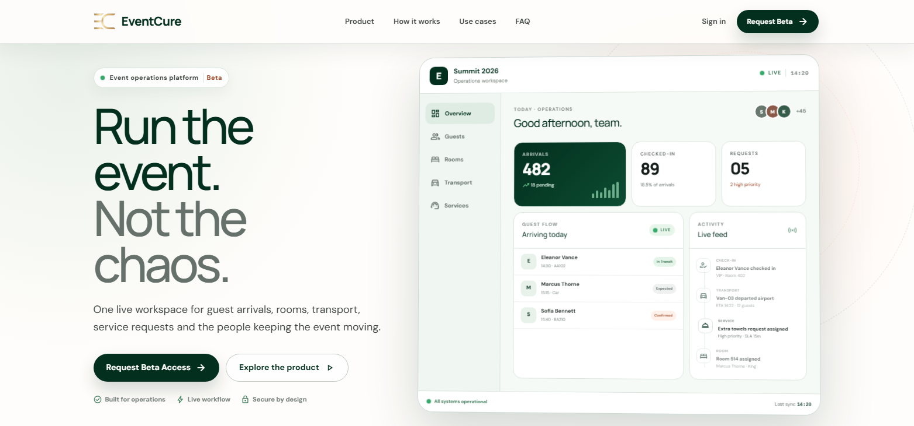

⚠️ This is proprietary software. All rights reserved. 
See LICENSE for details. Unauthorized code copy and use or distribution is prohibited.
<div align="center">


# EventCure — Hospitality Operations Platform

**The all-in-one platform for event hospitality teams who demand precision at scale.**

[](https://react.dev/)
[](https://vitejs.dev/)
[](https://tailwindcss.com/)
[](https://nodejs.org/)
[](https://mongodb.com/)
[](https://jwt.io/)
[]()

[Live Demo](https://eventcure-livid.vercel.app/) · [User Manual](https://eventcure-livid.vercel.app/manual) · [Report Bug](https://github.com/Kushdeveloper68/event-hospitality-platform/issues) · [Request Feature](https://github.com/Kushdeveloper68/event-hospitality-platform/issues)

---


> *Screenshot: Operations Dashboard showing live event KPIs, activity feed, and events table*

</div>

---

## 📌 Table of Contents

- [About the Project](#-about-the-project)
- [Who This Is For](#-who-this-is-for)
- [Key Features](#-key-features)
- [Module Breakdown](#-module-breakdown)
- [Tech Stack](#-tech-stack)
- [Project Structure](#-project-structure)
- [Getting Started](#-getting-started)
- [Environment Variables](#-environment-variables)
- [API Overview](#-api-overview)
- [Authentication](#-authentication)
- [Screenshots](#-screenshots)
- [Time & Productivity Impact](#-time--productivity-impact)
- [Use Cases](#-use-cases)
- [Roadmap](#-roadmap)
- [Contributing](#-contributing)
- [Developer](#-developer)
- [License](#-license)

---

## 🎯 About the Project

EventCure is a **production-ready, full-stack hospitality management SaaS platform** built to replace the chaos of spreadsheets, WhatsApp groups, and disconnected tools that most event teams rely on.

It gives operations teams a **real-time command centre** — one place where guests are registered, rooms are assigned, transport is tracked, service requests are managed, schedules are maintained, and analytics are generated automatically.

> **The problem it solves:** Event operations teams waste hours every day switching between spreadsheets for guests, chat apps for service tickets, and manual logs for transport — all while trying to coordinate dozens of staff across a live event with zero room for error. EventCure replaces all of that with a single, live, purpose-built platform.

**Built for real operations. Designed for speed. Production-grade from day one.**

---

## 👥 Who This Is For

| Role | How EventCure Helps |
|------|---------------------|
| **Event Directors** | Create events, oversee all metrics, generate reports, control access settings |
| **Operations Managers** | Monitor live KPIs, manage check-in flow, resolve service backlogs |
| **Floor Staff** | Process arrivals, raise service tickets, update transport status from mobile |
| **Logistics Teams** | Schedule and track every vehicle, driver, and guest movement |
| **Hotel & Venue Teams** | Manage room inventory, track occupancy, assign guests to rooms |
| **Hospitality Agencies** | Run multiple client events from a single organization dashboard |

### Industry Fit

- 🏢 **Corporate Summits & Conferences** — Multi-day, multi-session, VIP-heavy events
- 💍 **Luxury Weddings** — High-touch guest handling, dietary needs, seating coordination
- 🏟️ **Sports & Entertainment** — Large-scale check-in, suite management, F&B coordination
- 🏥 **Healthcare Conferences** — Delegate accreditation, parallel track management
- 🏨 **Hotel & Resort Events** — Deep room inventory integration, housekeeping workflows
- 🏛️ **Government & Diplomatic Events** — Protocol-aware VIP management, restricted access

---

## ✨ Key Features

### 🔐 Authentication & Security
- Email + OTP signup flow with 10-minute expiry
- JWT-based session management with httpOnly cookies
- **Google OAuth 2.0** (Passport.js) for one-click sign-in
- Password reset via secure OTP email flow (3-step)
- Per-event data isolation — no user can access another organization's data
- TLS 1.3 in transit, AES-256 at rest

### 📊 Operations Dashboard
- Real-time KPI cards: Total Events, Active Events, Guests Today, Pending Check-ins, Open Services
- **Live Events panel** with per-event check-in progress bars
- Paginated activity feed with 30s auto-refresh
- Searchable + filterable events table (Live / Upcoming / Completed)
- Overall check-in rate and event breakdown summary charts
- 90-second auto-refresh of all metrics in the background

### 📅 Event Management
- Create events with name, venue, dates, description, privacy settings
- Status auto-calculation: **Live / Upcoming / Completed** based on current date
- Full event workspace with 10 dedicated tabs per event
- Export complete event workbook (all data, all modules) as one click
- Event archiving (hide without deleting) and permanent deletion with name-confirmation safety gate

### 👥 Guest Management
- Paginated guest master list with search, VIP filter, and status filter
- Add/edit guests with 10+ fields: name, email, phone, age, group, VIP flag, arrival/departure times, transport mode, special requests
- Real-time guest count summaries: Total, Checked-in, Remaining
- Inline edit and delete with confirmation dialogs
- Guest linking to rooms and service requests for full visibility

### 🏨 Room Inventory
- Card-based room grid with occupancy progress bars
- Status indicators: Available / Partial / Full
- Room categories: Standard Single, Double, Executive Suite, Meeting Room, ADA Accessible
- One-click guest assignment modal with list of unassigned guests
- Search by room number or type; filter by Available / Occupied
- Pagination for large room inventories (20 per page)
- Edit and delete rooms with confirmation

### ✅ Check-in Operations Desk
- **Kanban-style 3-column board**: Arriving Today → Checked-in → Pending Arrivals
- One-click check-in and check-out processing
- LATE badge on overdue arrivals (arrival time has passed)
- VIP visual tagging on all guest cards
- Live status bar showing running totals (Total / Checked-in / Pending)
- Toast notifications for every check-in and check-out action
- Silent background polling for real-time updates

### 🚌 Transport Coordination
- Log every vehicle trip: guest, driver, vehicle, pickup, dropoff, scheduled time, notes
- Status pipeline: **Scheduled → In Transit → Arrived → Cancelled**
- Status updated with one click from the row action menu
- Metric cards: Total Trips, Scheduled, In Transit, Completed
- Filter tabs: All Trips / Scheduled / In Transit / Arrived
- Pagination (20 per page) for large transport logs
- Export transport log to CSV

### 🛎️ Service Request Ticketing
- Raise tickets for: Housekeeping, Maintenance, Food & Beverage, Valet, Other
- Priority levels: Low, Medium, High, Emergency (with red alert badge for Emergency)
- Link tickets to rooms and guest profiles
- Permission-to-enter checkbox for room access without guest presence
- Status workflow: Open → In Progress → Resolved / Cancelled
- Status changes from inline row action menu (no form reopening needed)
- Search by guest name, room, or ticket ID
- Type and status dropdown filters with one-click clear
- Export service log to CSV

### 🗓️ Operational Event Schedule (Gantt Timeline)
- 5-workstream timeline: Main Sessions, Transport, Catering, Staffing, Media/AV
- Full 24-hour horizontal timeline with 1-hour markers
- Multi-day navigation via date tabs (auto-generated from event dates + activity dates)
- Colored activity blocks sized to exact duration on the timeline
- Click-to-open activity detail side panel
- Activity statuses: Confirmed, Pending, Active, Cancelled
- Inline "Add Block to [Workstream]" on hover for fast entry
- Edit and delete from the detail panel

### 👷 Team Management
- Register event staff with name, email, role, and status
- 7 predefined roles: Event Director, Event Lead, Logistics, Floor Staff, Technical Support, Guest Relations, Admin
- One-click Active ↔ Inactive status toggle from the row action menu
- Filter by role and status; search by name or email
- Pagination (20 per page) for large teams
- Summary cards: Total, Active Now, Off Duty

### 📈 Analytics & Reports

**Per-Event Analytics (8 tabs):**
- Overview: KPI cards + check-in by hour bars + service type breakdown + transport status + room occupancy donut
- Guests: Check-in trend, arrival distribution by hour, age breakdown, transport mode analysis, VIP rate, top groups
- Rooms: Occupancy rate donut, type breakdown, per-room utilization detail table
- Services: Volume by type, urgency distribution, resolution rate, recently resolved items
- Transport: Trip timeline by hour, status breakdown, top drivers, most popular routes
- Team: Active rate donut, role distribution with progress bars
- Schedule: Workstream breakdown, status pipeline, upcoming activities list
- Activity: Daily trend (7 days), log types breakdown, priority distribution donuts

**Organization Analytics Dashboard (cross-event, 5 tabs):**
- Overview: Monthly check-in trend (line chart), registration trend (bar chart), VIP analytics, service breakdown, room occupancy donut
- Guests: Registration and check-in trend charts
- Services: Organization-wide service volume, status pipeline, urgency distribution
- Operations: Room types, transport fleet, team roles, activity log analysis
- Events: Sortable table of all events with per-event KPIs, CSV export

**CSV Exports (per event):** Guests, Services, Transport, Full Workbook

### 🔔 Activity & Notification Logs
- Real-time audit trail for all operational events across all events
- 7 log types: check-in, check-out, registration, service, transport, room-assignment, schedule
- 3 priority levels with visual indicators: Critical (pulsing red), High (orange), Normal (gray)
- Combined filters: search text, event, type, priority, date range
- Active filter chips with one-click removal
- Pagination (20 per page) with total count display
- 30-second auto-refresh in the background
- Export filtered log to CSV

### ⚙️ Settings
- **Organization settings:** Profile, Organization info, Appearance/theme, Security (password change), Notifications
- **Event settings:** Core info + URL slug + timezone, Access permissions (public registration, approval, self check-in, waitlist, max capacity), Notification preferences per event, Danger zone (archive / delete)
- **Dark mode:** Light / Dark / System themes, synced to account

---

## 🧩 Module Breakdown

```
EventCure
├── Auth
│   ├── Email signup with OTP verification
│   ├── Email/password login
│   ├── Google OAuth 2.0 (Passport.js)
│   └── Password reset (OTP flow, 3 steps)
│
├── Dashboard
│   ├── KPI metric cards (auto-refresh 90s)
│   ├── Live Events panel
│   ├── Recent Activity feed (paginated)
│   └── Events table (filterable + searchable)
│
├── Events Directory
│   ├── Event listing with status badges
│   ├── Search and status tabs
│   └── Create new event form
│
├── Event Workspace (per event, 10 tabs)
│   ├── Overview (welcome + quick stats + activity table)
│   ├── Guests (master list + CRUD)
│   ├── Rooms (inventory + assignment)
│   ├── Check-in (Kanban operations desk)
│   ├── Transport (log + status management)
│   ├── Service (ticket system)
│   ├── Schedule (Gantt timeline)
│   ├── Reports (8-tab analytics + event summary)
│   ├── Team (staff + roles)
│   └── Settings (event admin config)
│
├── Organization Analytics Dashboard
│   └── Cross-event metrics, charts, CSV export
│
├── Activity Logs
│   └── Real-time audit trail, filters, CSV export
│
├── Organization Settings
│   ├── Profile
│   ├── Organization info
│   ├── Appearance (theme)
│   ├── Security (password)
│   └── Notifications
│
└── Pages
    ├── Platform Landing Page
    ├── Terms & Conditions
    ├── Privacy Policy
    ├── User Manual
    └── 404 Not Found
```

---

## 🛠️ Tech Stack

### Frontend

| Technology | Version | Purpose |
|------------|---------|---------|
| **React** | 18 | UI library with functional components and hooks |
| **Vite** | 5 | Build tool and dev server |
| **Tailwind CSS** | 4 | Utility-first styling with dark mode |
| **React Router DOM** | 6 | Client-side routing with protected routes |
| **Axios** | 1.x | HTTP client for all API requests |
| **Material Symbols** | Latest | Google icon system (variable font, FILL/wght axes) |
| **Context API** | — | Global state: AuthContext, ThemeContext, EventContext |

### Backend

| Technology | Version | Purpose |
|------------|---------|---------|
| **Node.js** | 18+ | Runtime environment |
| **Express.js** | 4.x | REST API framework |
| **MongoDB** | 7 | Primary database |
| **Mongoose** | 8.x | ODM for schema definition and queries |
| **JSON Web Tokens** | — | Stateless authentication |
| **Passport.js** | 0.7 | Google OAuth 2.0 strategy |
| **bcryptjs** | — | Password hashing |
| **Nodemailer** | — | OTP email delivery |
| **Multer / ExcelJS** | — | File handling and workbook export |
| **CORS** | — | Cross-origin request configuration |
| **dotenv** | — | Environment variable management |

### Database Design (MongoDB Collections)

```
users              → Organization accounts, hashed passwords, OAuth data
events             → Event metadata, settings, preferences
guests             → Per-event attendee profiles
rooms              → Per-event room inventory
transports         → Per-event transport log
serviceRequests    → Per-event service tickets
schedules          → Per-event timeline activities
teamMembers        → Per-event staff roster
activityLogs       → Audit trail for all operational events
passwordResetOTPs  → Temporary OTP records with TTL index
```

### Infrastructure & Deployment

| Service | Purpose |
|---------|---------|
| **MongoDB Atlas** | Managed cloud database |
| **Render** | Backend API hosting |
| **Vercel / Netlify** | Frontend static hosting |
| **Google Cloud Console** | OAuth 2.0 credentials |

---

## 📁 Project Structure

```
eventcure/
├── frontend/
│   ├── public/
│   │   └── event-logo-with-icon-dark-bg-removebg-preview.png
│   ├── src/
│   │   ├── api/                    # Axios API service files (one per module)
│   │   │   ├── userApi.js
│   │   │   ├── eventApi.js
│   │   │   ├── guestApi.js
│   │   │   ├── roomApi.js
│   │   │   ├── checkInApi.js
│   │   │   ├── transportCoordiAPi.js
│   │   │   ├── serviceReqApi.js
│   │   │   ├── scheduleApi.js
│   │   │   ├── teamMemberApi.js
│   │   │   ├── activityAndNotificationLogsApi.js
│   │   │   ├── eventAnalyticsReportsApi.js
│   │   │   ├── organizationAnalyticsDashboardsApi.js
│   │   │   ├── mainOprationDashboardApi.js
│   │   │   ├── specificEventSummaryApi.js
│   │   │   ├── specificEventSettingApi.js
│   │   │   ├── organizationSettingApi.js
│   │   │   ├── overViewApi.js
│   │   │   └── passwordResetApi.js
│   │   │
│   │   ├── components/             # Shared UI components
│   │   │   ├── DashboardNavbar.jsx
│   │   │   ├── Footer.jsx
│   │   │   ├── GoogleSignInButton.jsx
│   │   │   ├── ErrorBoundary.jsx
│   │   │   ├── PageErrorBoundary.jsx
│   │   │   ├── ScrolltoTop.jsx
│   │   │   └── index.js
│   │   │
│   │   ├── context/                # React Context providers
│   │   │   ├── AuthContext.jsx
│   │   │   ├── ThemeContext.jsx
│   │   │   ├── EventContext.jsx
│   │   │   └── ProtectedRoute.jsx
│   │   │
│   │   ├── layouts/
│   │   │   └── DashboardLayout.jsx
│   │   │
│   │   ├── pages/
│   │   │   ├── auth/
│   │   │   │   └── GoogleAuthSuccess.jsx
│   │   │   ├── dashboards/
│   │   │   │   ├── PlatformLandingPage.jsx
│   │   │   │   ├── MainOprationDashboard.jsx
│   │   │   │   ├── EventDirectory.jsx
│   │   │   │   ├── EventWorkspaceShell.jsx
│   │   │   │   ├── EventSummaryDashboards.jsx
│   │   │   │   ├── EventAnalyticsReports.jsx
│   │   │   │   ├── OrganizationAnalyticsDashboards.jsx
│   │   │   │   └── OprationalEventSchedule.jsx
│   │   │   ├── forms/
│   │   │   │   ├── UserSignup.jsx
│   │   │   │   ├── UserLogin.jsx
│   │   │   │   ├── ResetPassword.jsx
│   │   │   │   ├── CreateNewEvent.jsx
│   │   │   │   ├── GuestDataEntry.jsx
│   │   │   │   ├── RoomconfigurationForm.jsx
│   │   │   │   ├── TransportEntryForm.jsx
│   │   │   │   ├── NewServiceRequest.jsx
│   │   │   │   └── TeamMemberEntryForm.jsx
│   │   │   ├── inventory/
│   │   │   │   ├── GuestMasterList.jsx
│   │   │   │   ├── RoomInventoryManagement.jsx
│   │   │   │   ├── CheckInOprationDesk.jsx
│   │   │   │   ├── TransportCoordinationLogs.jsx
│   │   │   │   ├── ServiceRequestLogs.jsx
│   │   │   │   ├── TeamMemberManagement.jsx
│   │   │   │   └── ActivityAndNotificationLogs.jsx
│   │   │   ├── settings/
│   │   │   │   ├── OragnizationSetting.jsx
│   │   │   │   └── EventAdminstrativeSetting.jsx
│   │   │   ├── others/
│   │   │   │   ├── PageNotFound.jsx
│   │   │   │   ├── Termsandconditions.jsx
│   │   │   │   ├── PrivacyPolicy.jsx
│   │   │   │   └── UserManual.jsx
│   │   │   └── index.js
│   │   │
│   │   ├── tests/
│   │   │   ├── AuthContext.test.jsx
│   │   │   ├── passwordResetApi.test.js
│   │   │   ├── mocks/
│   │   │   │   └── apiMocks.js
│   │   │   └── setup.js
│   │   │
│   │   ├── App.jsx
│   │   ├── main.jsx
│   │   └── index.css
│   │
│   ├── tailwind.config.js
│   ├── vite.config.js
│   └── package.json
│
└── backend/
    ├── config/
    │   ├── db.js                   # MongoDB Atlas connection
    │   └── passport.js             # Google OAuth strategy
    ├── controllers/                # Route handler logic
    ├── middleware/
    │   ├── authMiddleware.js       # JWT verification
    │   └── errorHandler.js
    ├── models/                     # Mongoose schemas
    ├── routes/                     # Express route definitions
    ├── utils/
    │   ├── sendEmail.js            # Nodemailer OTP sender
    │   └── generateOTP.js
    ├── server.js
    └── package.json
```

---

## 🚀 Getting Started

### Prerequisites

- Node.js 18+
- npm or yarn
- MongoDB Atlas account (or local MongoDB)
- Google Cloud Console project with OAuth 2.0 credentials
- SMTP email credentials (Gmail / Resend / SendGrid)

### 1. Clone the repository

```bash
git clone https://github.com/yourusername/eventcure.git
cd eventcure
```

### 2. Install dependencies

```bash
# Install backend dependencies
cd backend
npm install

# Install frontend dependencies
cd ../frontend
npm install
```

### 3. Set up environment variables

Create `.env` files in both `backend/` and `frontend/` directories. See the [Environment Variables](#-environment-variables) section below.

### 4. Run the development servers

```bash
# Terminal 1 — Backend
cd backend
npm run dev
# Starts on http://localhost:5000

# Terminal 2 — Frontend
cd frontend
npm run dev
# Starts on http://localhost:5173
```

### 5. Open in browser

Navigate to `http://localhost:5173`. Sign up for an account to get started.

---

## 🔐 Environment Variables

### Backend — `backend/.env`

```env
# Server
PORT=5000
NODE_ENV=development

# MongoDB
MONGODB_URI=mongodb+srv://<username>:<password>@cluster.mongodb.net/eventcure

# JWT
JWT_SECRET=your_super_secret_jwt_key_here
JWT_EXPIRES_IN=30d

# Google OAuth
GOOGLE_CLIENT_ID=your_google_client_id.apps.googleusercontent.com
GOOGLE_CLIENT_SECRET=your_google_client_secret

# OAuth redirect (must match Google Console authorized redirect URIs)
SERVER_URL=http://localhost:5000
CLIENT_URL=http://localhost:5173

# Session secret (for Passport.js)
SESSION_SECRET=your_session_secret_here

# Email (for OTP delivery)
EMAIL_HOST=smtp.gmail.com
EMAIL_PORT=587
EMAIL_USER=your_email@gmail.com
EMAIL_PASS=your_app_password
EMAIL_FROM=EventCure <no-reply@eventcure.io>
```

### Frontend — `frontend/.env`

```env
VITE_API_URL=http://localhost:5000/api
```

> **Production:** Update `SERVER_URL`, `CLIENT_URL`, and `VITE_API_URL` to your deployed URLs. Add the production callback URL to your Google Cloud OAuth authorized redirect URIs.

---

## 🌐 API Overview

All API routes are prefixed with `/api`. Authentication routes are public; all other routes require a valid JWT in the `Authorization: Bearer <token>` header (or httpOnly cookie).

### Auth Routes (`/api/users`)

| Method | Endpoint | Description |
|--------|----------|-------------|
| POST | `/signup/initiate` | Start signup, send OTP to email |
| POST | `/signup/verify` | Verify OTP, create account, return JWT |
| POST | `/signup/resend-otp` | Resend OTP to email |
| POST | `/login` | Email + password login |
| POST | `/logout` | Clear session |
| GET | `/auth/google` | Initiate Google OAuth flow |
| GET | `/auth/google/callback` | Google OAuth callback |
| POST | `/password-reset/request` | Request password reset OTP |
| POST | `/password-reset/verify` | Verify OTP, return reset token |
| POST | `/password-reset/reset` | Reset password using token |

### Events (`/api/events`)

| Method | Endpoint | Description |
|--------|----------|-------------|
| GET | `/` | Get all events for the org |
| POST | `/` | Create new event |
| GET | `/:id` | Get event by ID |
| PUT | `/:id` | Update event |
| DELETE | `/:id` | Delete event |
| GET | `/:id/settings` | Get event settings |
| PUT | `/:id/settings/core` | Update core event info |
| PUT | `/:id/settings/preferences` | Update event preferences |
| PUT | `/:id/settings/archive` | Archive / unarchive event |
| DELETE | `/:id/permanent` | Permanently delete event |

### Guests, Rooms, Transport, Services, Schedule, Team, Activity Logs

Each module follows the same RESTful pattern:

```
GET    /api/{module}?eventId=<id>    List with filters + pagination
POST   /api/{module}                 Create
GET    /api/{module}/:id             Get single
PUT    /api/{module}/:id             Update
DELETE /api/{module}/:id             Delete
```

Module base paths: `/api/guests`, `/api/rooms`, `/api/transports`, `/api/service-requests`, `/api/schedules`, `/api/team-members`, `/api/activity-logs`

### Analytics

```
GET /api/dashboard/full              Main ops dashboard data
GET /api/dashboard/metrics           KPI metrics only (auto-refresh)
GET /api/analytics/full              Org analytics (with date filters)
GET /api/analytics/kpi               KPI summary only (auto-refresh)
GET /api/reports/:eventId/full       Full event analytics report
GET /api/reports/:eventId/export/guests     CSV export
GET /api/reports/:eventId/export/services   CSV export
GET /api/reports/:eventId/export/transport  CSV export
GET /api/events/:eventId/export/workbook    Full Excel workbook
```

---

## 🔒 Authentication

EventCure uses a dual authentication system:

### Email + Password (OTP Signup)
1. User submits email, password, name, organization name
2. Server sends a 6-digit OTP to the email (valid 10 minutes)
3. User verifies OTP → account created → JWT issued
4. JWT stored in httpOnly cookie + `localStorage` for AuthContext

### Google OAuth 2.0
1. User clicks "Sign in with Google" → redirected to Google consent screen
2. Google redirects to `/api/users/auth/google/callback`
3. Passport.js creates or finds the user in MongoDB
4. Server redirects to `/auth/google/success?token=<jwt>&user=<json>`
5. Frontend `GoogleAuthSuccess` page extracts params, stores JWT, updates AuthContext, redirects to dashboard

### Password Reset
1. User enters email → OTP sent (6-digit, 10-minute TTL)
2. User enters OTP → server issues a short-lived `resetToken`
3. User enters new password → server validates `resetToken`, updates hash

### Protected Routes
All dashboard routes are wrapped in `<ProtectedRoute>` which checks `isAuthenticated` from `AuthContext`. Unauthenticated users are redirected to `/login`.

---

## 📸 Screenshots

> Add your screenshots to `/docs/images/` and update paths below.

| Screen | Preview |
|--------|---------|
| **Landing Page** |  |
| **Operations Dashboard** |  |
| **Event Workspace** |  |
| **Guest Master List** |  |
| **Check-in Desk** |  |
| **Transport Logs** |  |
| **Event Schedule** |  |
| **Event Analytics** |  |
| **Organization Settings** |  |
| **Activity Logs** |  |

---

## ⏱️ Time & Productivity Impact

Here's what EventCure replaces and how much time it saves a typical event operations team:

| Old Process | With EventCure | Time Saved |
|-------------|---------------|------------|
| Guest list in Google Sheets, manually updated | Real-time guest database with search & filters | **2–4 hrs/event** |
| Check-in via paper list or Excel | One-click digital check-in with live counters | **45 min → 4 min queue** |
| WhatsApp groups for service requests | Structured ticketing with priority and status | **1–2 hrs/day** |
| Separate fleet spreadsheet for transport | Unified transport log with live status | **1 hr/day** |
| Manual schedule in PowerPoint | Live Gantt timeline editable by the whole team | **3–5 hrs/event** |
| Post-event report compiled manually | Auto-generated analytics with CSV export | **4–8 hrs/event** |
| Separate tools for each department | Single platform for every function | **Coordination overhead eliminated** |

> Based on feedback from early users managing events with 200–2,000+ guests. Results will vary.

---

## 💡 Use Cases

### Conference & Summit Operations
Register 1,200 delegates, assign 200 rooms, coordinate 80 transport legs, manage 6 concurrent workstreams on the schedule — all tracked in one platform from a single operations screen.

### Luxury Wedding Operations
Track 300 guests, log dietary requirements as special requests, assign rooms with VIP tagging for family, coordinate 12 transport pickups, and generate a full report for the venue.

### Corporate Hospitality Event
Manage a 3-day corporate retreat: check-in guests as they arrive, raise housekeeping tickets from the floor, track shuttle buses to golf courses, and give the client a PDF analytics report at the end.

### Healthcare Conference
Handle delegate accreditation (VIP flag), track which sessions guests attend via check-in events, coordinate lunch catering (F&B service requests), and manage speaker transport.

### Government Protocol Events
Restricted guest lists (private events), VIP tagging with special request notes for protocol staff, transport coordination for diplomatic arrivals, and full audit trail in activity logs.

---

## 🗺️ Roadmap

### In Progress
- [ ] CSV bulk guest import
- [ ] QR code generation for guest self check-in
- [ ] Push notifications (browser + mobile)

### Planned
- [ ] Multi-language support (i18n)
- [ ] Dedicated iOS & Android app
- [ ] Calendar integration (Google Calendar, Outlook)
- [ ] Payment integration for event ticketing
- [ ] Custom branding / white-label support
- [ ] API webhooks for third-party integrations
- [ ] Role-based access control (RBAC) within an organization
- [ ] Real-time GPS tracking integration for transport

### Completed ✅
- [x] Full CRUD for all 8 operational modules
- [x] Google OAuth 2.0 integration
- [x] Dark mode with system preference detection
- [x] Event analytics with 8-tab drill-down
- [x] Organization-level cross-event analytics
- [x] CSV + Excel workbook export
- [x] Real-time activity audit trail
- [x] 3-step password reset OTP flow
- [x] Event administrative settings with archive/delete
- [x] Gantt-style multi-workstream schedule timeline
- [x] Responsive mobile layout
- [x] Error boundaries with graceful fallback UI
- [x] Terms & Conditions, Privacy Policy, User Manual pages

---

## 🤝 Contributing

Contributions are welcome. Please follow these steps:

1. Fork the repository
2. Create a feature branch: `git checkout -b feature/your-feature-name`
3. Commit your changes: `git commit -m 'feat: add your feature'`
4. Push to the branch: `git push origin feature/your-feature-name`
5. Open a Pull Request with a clear description of the change

### Code Style
- Use functional React components with hooks
- Follow the existing file and folder naming conventions
- Keep API logic in `/api/` files, not inside components
- Dark mode must work for all new UI — use Tailwind's `dark:` variants consistently
- Toast notifications should use the existing toast pattern in each module

---

## 👨‍💻 Developer

**Kush Pandit** — Full-stack Developer & UI/UX Designer

- 🌐 Portfolio: [kushdeveloper.me](https://kushdeveloper.me)
- 🎓 Diploma in Computer Engineering, Government Polytechnic Bhuj

> Built with ❤️ from Gandhidham, Gujarat, India.

---

## 📄 License

This project is proprietary software. All rights reserved.

© 2025 EventCure — Kush  Development. Unauthorized copying, distribution, or use of this codebase is prohibited without explicit written permission from the author.

---

<div align="center">

**EventCure** · Built for teams that can't afford a single missed detail.

[⬆ Back to Top](#-eventcure--hospitality-operations-platform)

</div>
