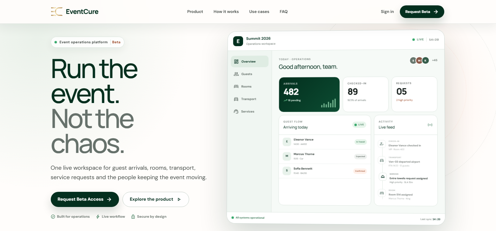

⚠️ This is proprietary software. All rights reserved. 
See LICENSE for details. Unauthorized code copy and use or distribution is prohibited.
<div align="center">


# EventCure — Hospitality Operations Platform

**The all-in-one platform for event hospitality teams who demand precision at scale.**

[](https://react.dev/)
[](https://vitejs.dev/)
[](https://tailwindcss.com/)
[](https://nodejs.org/)
[](https://mongodb.com/)
[](https://jwt.io/)
[]()
[]()

[Live Site](https://eventcure.in) · [User Manual](https://eventcure.in/manual) · [CSV Import Guide](https://eventcure.in/import-guide) · [Report Bug](https://github.com/Kushdeveloper68/event-hospitality-platform/issues) · [Request Feature](https://github.com/Kushdeveloper68/event-hospitality-platform/issues) · [Contact](mailto:hello.eventcure@gmail.com)

---


> *Screenshot: Operations Dashboard showing live event KPIs, activity feed, and events table*

</div>

---

## 📌 Table of Contents

- [About the Project](#-about-the-project)
- [Who This Is For](#-who-this-is-for)
- [Key Features](#-key-features)
- [Bulk CSV Import](#-bulk-csv-import)
- [Module Breakdown](#-module-breakdown)
- [Tech Stack](#-tech-stack)
- [Project Structure](#-project-structure)
- [Getting Started](#-getting-started)
- [Environment Variables](#-environment-variables)
- [API Overview](#-api-overview)
- [Authentication](#-authentication)
- [Security & Hardening](#-security--hardening)
- [Testing](#-testing)
- [Deployment](#-deployment)
- [Screenshots](#-screenshots)
- [Time & Productivity Impact](#-time--productivity-impact)
- [Example Scenarios](#-example-scenarios)
- [Roadmap](#-roadmap)
- [Contributing](#-contributing)
- [Developer](#-developer)
- [License](#-license)

---

## 🎯 About the Project

EventCure is a **full-stack hospitality management SaaS platform** (currently in **public beta**) built to replace the chaos of spreadsheets, WhatsApp groups, and disconnected tools that most event teams rely on.

It gives operations teams a **real-time command centre** — one place where guests are registered, rooms are assigned, transport is tracked, service requests are managed, schedules are maintained, and analytics are generated automatically.

> **The problem it solves:** Event operations teams waste hours every day switching between spreadsheets for guests, chat apps for service tickets, and manual logs for transport — all while trying to coordinate dozens of staff across a live event with zero room for error. EventCure replaces all of that with a single, live, purpose-built platform.

**Built for real operations. Designed for speed. Live at [eventcure.in](https://eventcure.in).**

---

## 👥 Who This Is For

| Role | How EventCure Helps |
|------|---------------------|
| **Event Directors** | Create events, oversee all metrics, generate reports, control access settings |
| **Operations Managers** | Monitor live KPIs, manage check-in flow, resolve service backlogs |
| **Floor Staff** | Process arrivals, raise service tickets, update transport status from mobile |
| **Logistics Teams** | Schedule and track every vehicle, driver, and guest movement |
| **Hotel & Venue Teams** | Manage room inventory, track occupancy, assign guests to rooms |
| **Hospitality Agencies** | Run multiple client events from a single organization dashboard |

### Industry Fit

- 🏢 **Corporate Summits & Conferences** — Multi-day, multi-session, VIP-heavy events
- 💍 **Luxury Weddings** — High-touch guest handling, dietary needs, seating coordination
- 🏟️ **Sports & Entertainment** — Large-scale check-in, suite management, F&B coordination
- 🏥 **Healthcare Conferences** — Delegate accreditation, parallel track management
- 🏨 **Hotel & Resort Events** — Deep room inventory integration, housekeeping workflows
- 🏛️ **Government & Diplomatic Events** — Protocol-aware VIP management, restricted access

---

## ✨ Key Features

### 🔐 Authentication & Security
- Email + OTP signup flow with 10-minute expiry (OTP delivered through the **Gmail API**)
- JWT-based session management with httpOnly cookies
- **Google OAuth 2.0** (Passport.js) for one-click sign-in
- Password reset via secure OTP email flow (3-step)
- Per-event data isolation — ownership is verified on every event-scoped request, and checks **fail closed** (a request with no authenticated user is rejected, never waved through)
- `helmet` security headers, global rate limiting, and request-size limits (see [Security & Hardening](#-security--hardening))

### 📊 Operations Dashboard
- Real-time KPI cards: Total Events, Active Events, Guests Today, Pending Check-ins, Open Services
- **Live Events panel** with per-event check-in progress bars
- Paginated activity feed with 30s auto-refresh
- Searchable + filterable events table (Live / Upcoming / Completed)
- Overall check-in rate and event breakdown summary charts
- 90-second auto-refresh of all metrics in the background

### 📅 Event Management
- Create events with name, venue, dates, description, privacy settings
- After creating an event you land **directly inside its workspace** (no detour through the events list)
- **Guided setup checklist** on the Overview tab: add rooms → add guests → add team, with a progress bar and one-click links. It disappears into the live-operations summary once the event is set up
- Status auto-calculation: **Live / Upcoming / Completed** based on current date
- Full event workspace with 10 dedicated tabs per event
- Export complete event workbook (all data, all modules) in one click
- Event archiving (hide without deleting) and permanent deletion with name-confirmation safety gate

### 👥 Guest Management
- Paginated guest master list with server-side search, VIP filter, and status filter (debounced)
- Add/edit guests with 10+ fields: name, email, phone, age, group, VIP flag, **arrival / departure date-time**, special requests
- Arrival date-time is required — it powers the Check-in desk's "Arriving Today" and LATE logic
- **Bulk CSV import** for large guest lists (see [Bulk CSV Import](#-bulk-csv-import))
- Real-time guest count summaries: Total, Checked-in, Remaining
- Inline edit and delete with confirmation dialogs
- Guest linking to rooms and service requests for full visibility

### 🏨 Room Inventory
- Card-based room grid with occupancy progress bars
- Status indicators: Available / Partial / Full
- Room categories: Standard Single, Double, Executive Suite, Meeting Room, ADA Accessible
- One-click guest assignment modal with list of unassigned guests
- **Event-wide stat cards** (Total Rooms, Total Capacity, Current Occupancy, Available) computed on the server across *all* rooms — they don't change when you move between pages
- **Server-side search and Available / Occupied filters** that search every room in the event, not just the page on screen
- "Export" downloads *every* room matching the current filter, not just the visible page
- Pagination for large room inventories (20 per page)
- **Bulk CSV import** for rooms
- Edit and delete rooms with confirmation

### ✅ Check-in Operations Desk
- **Kanban-style 3-column board**: Arriving Today → Checked-in → Pending Arrivals
- One-click check-in and check-out processing
- LATE badge on overdue arrivals (arrival time has passed)
- VIP visual tagging on all guest cards
- Live status bar showing running totals (Total / Checked-in / Pending)
- Toast notifications for every check-in and check-out action
- Silent background polling for real-time updates

### 🚌 Transport Coordination
- Log every vehicle trip: guest, driver, vehicle, pickup, dropoff, scheduled time, notes
- Status pipeline: **Scheduled → In Transit → Arrived → Cancelled**
- Status updated with one click from the row action menu
- Metric cards: Total Trips, Scheduled, In Transit, Completed
- Filter tabs: All Trips / Scheduled / In Transit / Arrived
- Pagination (20 per page) for large transport logs
- Export transport log to CSV

### 🛎️ Service Request Ticketing
- Raise tickets for: Housekeeping, Maintenance, Food & Beverage, Valet, Other
- Priority levels: Low, Medium, High, Emergency (with red alert badge for Emergency)
- Link tickets to rooms and guest profiles
- Permission-to-enter checkbox for room access without guest presence
- Status workflow: Open → In Progress → Resolved / Cancelled
- Status changes from inline row action menu (no form reopening needed)
- Search by guest name, room, or ticket ID
- Type and status dropdown filters with one-click clear
- Export service log to CSV

### 🗓️ Operational Event Schedule (Gantt Timeline)
- 5-workstream timeline: Main Sessions, Transport, Catering, Staffing, Media/AV
- Full 24-hour horizontal timeline with 1-hour markers
- Multi-day navigation via date tabs (auto-generated from event dates + activity dates)
- Colored activity blocks sized to exact duration on the timeline
- Click-to-open activity detail side panel
- Activity statuses: Confirmed, Pending, Active, Cancelled
- Inline "Add Block to [Workstream]" on hover for fast entry
- Edit and delete from the detail panel

### 👷 Team Management
- Register event staff with name, email, role, and status
- 7 predefined roles: Event Director, Event Lead, Logistics, Floor Staff, Technical Support, Guest Relations, Admin
- One-click Active ↔ Inactive status toggle from the row action menu
- Filter by role and status; search by name or email
- Pagination (20 per page) for large teams
- Summary cards: Total, Active Now, Off Duty
- **Bulk CSV import** for team members

### 📈 Analytics & Reports

**Per-Event Analytics (8 tabs):**
- Overview: KPI cards + check-in by hour bars + service type breakdown + transport status + room occupancy donut
- Guests: Check-in trend, arrival distribution by hour, age breakdown, transport mode analysis, VIP rate, top groups
- Rooms: Occupancy rate donut, type breakdown, per-room utilization detail table
- Services: Volume by type, urgency distribution, resolution rate, recently resolved items
- Transport: Trip timeline by hour, status breakdown, top drivers, most popular routes
- Team: Active rate donut, role distribution with progress bars
- Schedule: Workstream breakdown, status pipeline, upcoming activities list
- Activity: Daily trend (7 days), log types breakdown, priority distribution donuts

**Organization Analytics Dashboard (cross-event, 5 tabs):**
- Overview: Monthly check-in trend (line chart), registration trend (bar chart), VIP analytics, service breakdown, room occupancy donut
- Guests: Registration and check-in trend charts
- Services: Organization-wide service volume, status pipeline, urgency distribution
- Operations: Room types, transport fleet, team roles, activity log analysis
- Events: Sortable table of all events with per-event KPIs, CSV export

**CSV Exports (per event):** Guests, Services, Transport, Full Workbook

### 🔔 Activity & Notification Logs
- Real-time audit trail for all operational events across all events
- 7 log types: check-in, check-out, registration, service, transport, room-assignment, schedule
- 3 priority levels with visual indicators: Critical (pulsing red), High (orange), Normal (gray)
- Combined filters: search text, event, type, priority, date range
- Active filter chips with one-click removal
- Pagination (20 per page) with total count display
- 30-second auto-refresh in the background
- Export filtered log to CSV

### 📥 Bulk CSV Import
Add guests, rooms or team members in bulk instead of filling forms one by one. See the dedicated [Bulk CSV Import](#-bulk-csv-import) section.

### ⚙️ Settings
- **Organization settings:** Profile, Organization info, Appearance/theme, Security (password change), Notifications
- **Event settings:** Core info + URL slug + timezone, Access permissions (public registration, approval, self check-in, waitlist, max capacity), Notification preferences per event, Danger zone (archive / delete)
- **Dark mode:** Light / Dark / System themes, synced to account

---

## 📥 Bulk CSV Import

Available on the **Guests**, **Rooms** and **Team** tabs via the **Import CSV** button next to the regular *Add* button.

**Flow:** download the sample template → fill it in (Excel / Google Sheets, saved as `.csv`) → upload → preview the first rows → import. Every row is validated independently, so a few bad rows never block the rest; the result screen lists exactly which row failed and why.

| Module | Required columns | Optional columns |
|--------|------------------|------------------|
| **Guests** | `fullName`, `arrivalDatetime` | `email`, `phoneNumber`, `age`, `groupName`, `vipStatus`, `departureDatetime`, `specialRequests` |
| **Rooms** | `number` | `capacity`, `type` (`standard`, `double`, `suite`, `meeting`, `accessible`), `notes` |
| **Team** | `name`, `email` | `role` |

- **Date format:** `YYYY-MM-DD HH:mm` (24-hour), e.g. `2026-10-06 14:00`; a bare `YYYY-MM-DD` is treated as midnight. `departureDatetime` must be after `arrivalDatetime`.
- **Limits:** up to 1000 rows per import; team emails must be unique per event.
- **Templates:** ready-made files live in [`frontend/public/templates/`](frontend/public/templates) and are linked from the in-app **[CSV Import Guide](https://eventcure.in/import-guide)** page and the site footer.
- **API:** `POST /api/guests/bulk-import`, `POST /api/rooms/bulk-import`, `POST /api/team/bulk-import` — body `{ "event": "<eventId>", "rows": [ ... ] }`, response `{ success, createdCount, failedCount, failed: [{ row, reason }] }`.

---

## 🧩 Module Breakdown

```
EventCure
├── Auth
│   ├── Email signup with OTP verification
│   ├── Email/password login
│   ├── Google OAuth 2.0 (Passport.js)
│   └── Password reset (OTP flow, 3 steps)
│
├── Dashboard
│   ├── KPI metric cards (auto-refresh 90s)
│   ├── Live Events panel
│   ├── Recent Activity feed (paginated)
│   └── Events table (filterable + searchable)
│
├── Events Directory
│   ├── Event listing with status badges
│   ├── Search and status tabs
│   └── Create new event form
│
├── Event Workspace (per event, 10 tabs)
│   ├── Overview (setup checklist + quick stats + activity table)
│   ├── Guests (master list + CRUD + CSV import)
│   ├── Rooms (inventory + assignment + CSV import)
│   ├── Check-in (Kanban operations desk)
│   ├── Transport (log + status management)
│   ├── Service (ticket system)
│   ├── Schedule (Gantt timeline)
│   ├── Reports (8-tab analytics + event summary)
│   ├── Team (staff + roles + CSV import)
│   └── Settings (event admin config)
│
├── Organization Analytics Dashboard
│   └── Cross-event metrics, charts, CSV export
│
├── Activity Logs
│   └── Real-time audit trail, filters, CSV export
│
├── Organization Settings
│   ├── Profile
│   ├── Organization info
│   ├── Appearance (theme)
│   ├── Security (password)
│   └── Notifications
│
└── Pages
    ├── Platform Landing Page (with product walkthrough video)
    ├── CSV Import Guide + downloadable templates
    ├── Terms & Conditions
    ├── Privacy Policy
    ├── User Manual
    └── 404 Not Found
```

---

## 🛠️ Tech Stack

### Frontend

| Technology | Version | Purpose |
|------------|---------|---------|
| **React** | 19 | UI library with functional components and hooks |
| **Vite** | 7 | Build tool and dev server |
| **Tailwind CSS** | 4 | Utility-first styling with dark mode |
| **React Router DOM** | 7 | Client-side routing with protected routes |
| **Axios** | 1.x | HTTP client for all API requests |
| **Material Symbols** | Latest | Google icon system (variable font, FILL/wght axes) |
| **Context API** | — | Global state: AuthContext, ThemeContext, EventContext |
| **Vitest + Testing Library** | — | Frontend unit tests |

### Backend

| Technology | Version | Purpose |
|------------|---------|---------|
| **Node.js** | 18+ | Runtime environment |
| **Express.js** | 5.x | REST API framework |
| **MongoDB** | Atlas | Primary database |
| **Mongoose** | 9.x | ODM for schema definition, queries and aggregations |
| **JSON Web Tokens** | — | Stateless authentication |
| **Passport.js** | 0.7 | Google OAuth 2.0 strategy |
| **bcryptjs** | — | Password hashing |
| **googleapis (Gmail API)** | 144 | OTP / transactional email delivery over OAuth2 |
| **ExcelJS** | 4.x | Event workbook export |
| **helmet / express-rate-limit** | — | Security headers and request throttling |
| **compression / morgan / cors** | — | Response compression, request logging, CORS |
| **Jest + Supertest + mongodb-memory-server** | — | Backend tests |

### Database Design (MongoDB Models)

```
User              → Organization accounts, hashed passwords, OAuth data
Event             → Event metadata and core info
EventSetting      → Per-event access permissions and preferences
OrgSettings       → Organization-level profile, theme, notifications
Guest             → Per-event attendee profiles (arrival / departure, room, check-in state)
Room              → Per-event room inventory
Transport         → Per-event transport log
ServiceRequest    → Per-event service tickets
Schedule          → Per-event timeline activities
TeamMember        → Per-event staff roster
ActivityLog       → Audit trail for all operational events
```

### Infrastructure & Deployment

| Service | Purpose |
|---------|---------|
| **MongoDB Atlas** | Managed cloud database |
| **Render** | Backend API hosting (`api.eventcure.in`) |
| **Vercel** | Frontend hosting (`eventcure.in`) |
| **Google Cloud Console** | OAuth 2.0 credentials + Gmail API |

---

## 📁 Project Structure

```
event-hospitality-platform/
├── frontend/
│   ├── public/
│   │   ├── templates/              # Downloadable CSV import templates
│   │   │   ├── guests-template.csv
│   │   │   ├── rooms-template.csv
│   │   │   └── team-template.csv
│   │   ├── robots.txt              # Search engine crawl rules
│   │   ├── sitemap.xml             # Public pages for Google Search Console
│   │   └── (logos, landing-page.png, manual images)
│   ├── src/
│   │   ├── api/                    # Axios API service files (one per module)
│   │   ├── components/             # Shared UI: Footer, Navbar, DashboardNavbar,
│   │   │                           #   CsvImportModal, GoogleSignInButton, error boundaries
│   │   ├── context/                # AuthContext, ThemeContext, EventContext, ProtectedRoute
│   │   ├── layouts/                # DashboardLayout
│   │   ├── pages/
│   │   │   ├── admin/              # AdminDashboard
│   │   │   ├── auth/               # GoogleAuthSuccess
│   │   │   ├── dashboards/         # Landingpage, MainOprationDashboard, EventDirectory,
│   │   │   │                       #   EventWorkspaceShell, EventSummaryDashboards,
│   │   │   │                       #   EventAnalyticsReports, OrganizationAnalyticsDashboards,
│   │   │   │                       #   OprationalEventSchedule
│   │   │   ├── forms/              # Signup, Login, ResetPassword, CreateNewEvent,
│   │   │   │                       #   GuestDataEntry, RoomconfigurationForm,
│   │   │   │                       #   TransportEntryForm, NewServiceRequest, TeamMemberEntryForm
│   │   │   ├── inventory/          # GuestMasterList, RoomInventoryManagement, CheckInOprationDesk,
│   │   │   │                       #   TransportCoordinationLogs, ServiceRequestLogs,
│   │   │   │                       #   TeamMemberManagement, ActivityAndNotificationLogs
│   │   │   ├── settings/           # OragnizationSetting, EventAdminstrativeSetting, ...
│   │   │   └── others/             # UserManual, ImportGuide, Termsandconditions,
│   │   │                           #   PrivacyPolicy, PageNotFound, modals & empty states
│   │   ├── tests/                  # Vitest suites + API mocks
│   │   ├── App.jsx
│   │   ├── main.jsx
│   │   └── index.css
│   ├── vercel.json                 # SPA rewrites
│   ├── vite.config.js
│   └── package.json
│
└── backend/
    ├── config/
    │   ├── passport.js             # Google OAuth strategy
    │   └── googleMailer.js         # Gmail API (OAuth2) mail client
    ├── connections/
    │   └── mongodbConnection.js    # MongoDB Atlas connection
    ├── controllers/                # Request handlers
    ├── services/                   # Business logic (incl. bulk-import + aggregations)
    ├── models/                     # Mongoose schemas
    ├── routes/                     # Express route definitions
    ├── middlewares/                # authMiddleware, adminMiddleware, globalLimiter, rateLimiter
    ├── helpers/
    │   └── emailHelper.js          # OTP generation + email sending
    ├── __tests__/                  # Jest suites (auth, events, middleware, password reset, export)
    ├── tests/helpers/              # Test app, in-memory DB and auth helpers
    ├── getGmailRefreshToken.js     # One-time script to mint the Gmail refresh token
    ├── server.js
    └── package.json
```

---

## 🚀 Getting Started

### Prerequisites

- Node.js 18+
- npm
- MongoDB Atlas account (or local MongoDB)
- A Google Cloud project with an **OAuth 2.0 client** and the **Gmail API** enabled
- A Gmail address to send OTP emails from (e.g. a dedicated product mailbox)

### 1. Clone the repository

```bash
git clone https://github.com/Kushdeveloper68/event-hospitality-platform.git
cd event-hospitality-platform
```

### 2. Install dependencies

```bash
# Backend
cd backend
npm install

# Frontend
cd ../frontend
npm install
```

### 3. Set up environment variables

Copy `backend/.env.example` to `backend/.env` and `frontend/.env.example` to `frontend/.env`, then fill them in — see [Environment Variables](#-environment-variables).

### 4. Generate the Gmail refresh token (one-time)

OTP emails are sent through the Gmail API, so the sender account must consent once:

```bash
cd backend
node getGmailRefreshToken.js
```

Open the printed URL, **sign in with the Gmail account you want to send from**, approve, and paste the printed refresh token into `GOOGLE_MAILER_REFRESH_TOKEN`. If your Google app is still in *Testing* mode, add that account under **Audience → Test users**. The script's redirect URI (`http://localhost:5000/oauth2callback`) must be listed in the OAuth client's authorized redirect URIs.

### 5. Run the development servers

```bash
# Terminal 1 — Backend (nodemon)
cd backend
npm start
# Starts on http://localhost:7000

# Terminal 2 — Frontend
cd frontend
npm run dev
# Starts on http://localhost:5173
```

### 6. Open in browser

Navigate to `http://localhost:5173`, sign up, create an event, and follow the setup checklist. To try the importer with real-looking data, use the templates in `frontend/public/templates/`.

---

## 🔐 Environment Variables

### Backend — `backend/.env`

```env
# Server
PORT=7000
NODE_ENV=development

# MongoDB
MONGO_URI=mongodb+srv://<username>:<password>@cluster.mongodb.net/eventcure

# JWT (tokens are issued with a 7-day expiry)
JWT_SECRET=your_super_secret_jwt_key_here

# URLs — used for CORS and for building the Google OAuth callback
CLIENT_URL=http://localhost:5173
SERVER_URL=http://localhost:7000

# Google OAuth client — used for BOTH "Sign in with Google" AND the Gmail API mailer
GOOGLE_CLIENT_ID=your_google_client_id.apps.googleusercontent.com
GOOGLE_CLIENT_SECRET=your_google_client_secret

# Gmail API mailer (OTP emails)
# Generate the refresh token once with:  node getGmailRefreshToken.js
GOOGLE_MAILER_REDIRECT_URI=http://localhost:7000/oauth2callback
GOOGLE_MAILER_REFRESH_TOKEN=paste_generated_refresh_token_here
GOOGLE_SENDER_EMAIL=the_gmail_address_you_send_from@gmail.com
```

> `GOOGLE_SENDER_EMAIL` is only the label — the account that actually sends mail is the one that approved the consent screen when the refresh token was generated. If you change the sender account, **regenerate the refresh token** with that account.

### Frontend — `frontend/.env`

```env
# Must include the /api prefix
VITE_API_URL=http://localhost:7000/api
```

### Production values

| Variable | Production value |
|----------|------------------|
| `CLIENT_URL` | `https://eventcure.in` (single canonical origin — CORS allows exactly one) |
| `SERVER_URL` | `https://api.eventcure.in` |
| `VITE_API_URL` | `https://api.eventcure.in/api` |

Add `https://api.eventcure.in/api/users/auth/google/callback` to the OAuth client's **Authorized redirect URIs** and `https://eventcure.in` to **Authorized JavaScript origins**. Redirect `www.eventcure.in` → `eventcure.in` at the hosting level so the browser origin always matches `CLIENT_URL`.

---

## 🌐 API Overview

All API routes are prefixed with `/api`. Signup, login, Google OAuth and password-reset routes are public; everything else requires a valid JWT (`Authorization: Bearer <token>` or the httpOnly cookie). `GET /health` is a public health check.

### Auth (`/api/users`)

| Method | Endpoint | Description |
|--------|----------|-------------|
| POST | `/signup` | Start signup, send OTP to email |
| POST | `/verify-otp` | Verify OTP, create account, return JWT |
| POST | `/resend-otp` | Resend OTP |
| POST | `/login` | Email + password login |
| POST | `/logout` | Clear session |
| GET | `/auth/google` | Start Google OAuth flow |
| GET | `/auth/google/callback` | Google OAuth callback |

### Password reset (`/api/password-reset`)

`POST /request` → `POST /verify-otp` → `POST /reset`

### Events (`/api/events`, `/api/event-settings`)

| Method | Endpoint | Description |
|--------|----------|-------------|
| POST | `/api/events/create` | Create event |
| GET | `/api/events` | List the organization's events |
| GET / PUT / DELETE | `/api/events/:eventId` | Read, update, delete |
| GET | `/api/event-settings/:eventId` | Event settings |
| PUT | `/api/event-settings/:eventId/core` · `/preferences` · `/archive` | Update core info, preferences, archive state |
| POST | `/api/event-settings/:eventId/generate-slug` | Generate URL slug |
| DELETE | `/api/event-settings/:eventId/delete` | Permanent delete |

### Guests · Rooms · Team

| Resource | Base path | Notes |
|----------|-----------|-------|
| Guests | `/api/guests` | `POST /`, `GET /` (filters: `search`, `vip`, `status`, `page`, `limit`), `GET/PUT/DELETE /:guestId`, `POST /bulk-import` |
| Rooms | `/api/rooms` | `POST /`, `GET /` (filters: `search`, `status`, `page`, `limit`; returns event-wide `stats`), `GET /export`, `GET/PUT/DELETE /:roomId`, `POST /:roomId/assign`, `POST /bulk-import` |
| Team | `/api/team` | `POST /`, `GET /`, `GET /summary`, `GET/PUT/DELETE /:memberId`, `POST /bulk-import` |

### Operations modules

| Resource | Base path | Highlights |
|----------|-----------|------------|
| Check-in | `/api/checkin` | `GET /arriving-today`, `/checked-in`, `/pending`, `/summary`; `PUT /:guestId/check-in`, `/:guestId/check-out` |
| Transport | `/api/transport` | `POST /create`, `GET /`, `GET /summary`, `PUT /:transportId/status`, CRUD by `:transportId` |
| Services | `/api/services` | `POST /create`, `GET /`, `GET /summary`, `PUT /:requestId/status`, CRUD by `:requestId` |
| Schedule | `/api/schedules` | `POST /`, `GET /event/:eventId`, `PUT/DELETE /:id` |
| Activity logs | `/api/activity-logs` | `GET /`, `/summary`, `/types` |
| Overview | `/api/overview/:eventId` | Metrics for the event Overview tab |

### Dashboards, analytics & exports

```
GET /api/main-dashboard                       Main ops dashboard (also /metrics, /recent-activity, /upcoming-events, /active-events)
GET /api/org-analytics/full                   Organization analytics (also /kpis, /checkin-trend, /registration-trend, /vip, ...)
GET /api/event-analytics/:eventId/full        Full event report (also /guests, /rooms, /services, /transport, /team, /schedule, /activity)
GET /api/event-analytics/:eventId/export/guests | services | transport | workbook
GET /api/event-summary/:eventId               Event summary (also /kpis)
GET /api/org-settings                         Organization settings (PUT /profile, /organization, /password, /notifications, /theme)
```

---

## 🔒 Authentication

EventCure uses a dual authentication system:

### Email + Password (OTP Signup)
1. User submits email, password, name, organization name
2. Server sends a 6-digit OTP to the email (valid 10 minutes)
3. User verifies OTP → account created → JWT issued
4. JWT stored in httpOnly cookie + `localStorage` for AuthContext

### Google OAuth 2.0
1. User clicks "Sign in with Google" → redirected to Google consent screen
2. Google redirects to `/api/users/auth/google/callback` (on `api.eventcure.in` in production)
3. Passport.js creates or finds the user in MongoDB
4. Server redirects to `/auth/google/success?token=<jwt>&user=<json>`
5. Frontend `GoogleAuthSuccess` page extracts params, stores JWT, updates AuthContext, redirects to dashboard

### Password Reset
1. User enters email → OTP sent (6-digit, 10-minute TTL)
2. User enters OTP → server issues a short-lived `resetToken`
3. User enters new password → server validates `resetToken`, updates hash

### Protected Routes
All dashboard routes are wrapped in `<ProtectedRoute>` which checks `isAuthenticated` from `AuthContext`. Unauthenticated users are redirected to `/login`.

---

## 📸 Screenshots

> Add your screenshots to `/docs/images/` and update paths below.

| Screen | Preview |
|--------|---------|
| **Landing Page** |  |
| **Operations Dashboard** |  |
| **Event Workspace** |  |
| **Guest Master List** |  |
| **Check-in Desk** |  |
| **Transport Logs** |  |
| **Event Schedule** |  |
| **Event Analytics** |  |
| **Organization Settings** |  |
| **Activity Logs** |  |

---

## ⏱️ Time & Productivity Impact

Where EventCure is designed to save a typical event operations team time. These are **estimates based on common manual workflows**, not measured results — EventCure is in beta and real-world numbers will be published as events run on it.

| Old Process | With EventCure | Estimated Saving |
|-------------|---------------|------------------|
| Guest list in Google Sheets, manually updated | Real-time guest database with search & filters | **2–4 hrs/event** |
| Typing guests, rooms and staff in one by one | CSV bulk import with per-row error reporting | **Hours on large lists** |
| Check-in via paper list or Excel | One-click digital check-in with live counters | **Shorter arrival queues** |
| WhatsApp groups for service requests | Structured ticketing with priority and status | **1–2 hrs/day** |
| Separate fleet spreadsheet for transport | Unified transport log with live status | **~1 hr/day** |
| Manual schedule in PowerPoint | Live Gantt timeline editable by the whole team | **3–5 hrs/event** |
| Post-event report compiled manually | Auto-generated analytics with CSV export | **4–8 hrs/event** |

---

## 💡 Example Scenarios

> Illustrative scenarios showing how teams can use EventCure.

### Conference & Summit Operations
Register 1,200 delegates, assign 200 rooms, coordinate 80 transport legs, manage 6 concurrent workstreams on the schedule — all tracked in one platform from a single operations screen.

### Luxury Wedding Operations
Track 300 guests, log dietary requirements as special requests, assign rooms with VIP tagging for family, coordinate 12 transport pickups, and generate a full report for the venue.

### Corporate Hospitality Event
Manage a 3-day corporate retreat: check-in guests as they arrive, raise housekeeping tickets from the floor, track shuttle buses to golf courses, and give the client a PDF analytics report at the end.

### Healthcare Conference
Handle delegate accreditation (VIP flag), track which sessions guests attend via check-in events, coordinate lunch catering (F&B service requests), and manage speaker transport.

### Government Protocol Events
Restricted guest lists (private events), VIP tagging with special request notes for protocol staff, transport coordination for diplomatic arrivals, and full audit trail in activity logs.

---

## 🛡️ Security & Hardening

- **Fail-closed ownership checks** — every event-scoped controller verifies the signed-in user owns the event; a missing user is rejected with `401`, never skipped
- **Security headers** via `helmet`
- **Rate limiting** — global limiter (1000 requests / 15 min per IP) plus stricter limiters on sensitive routes
- **Request size cap** — JSON / URL-encoded bodies limited to 2 MB (enough for a full 1000-row import)
- **Bulk import guardrails** — authenticated, ownership-verified, capped at 1000 rows, per-row validation; free-text search input is regex-escaped
- **Single CORS origin** — only `CLIENT_URL` is allowed, with credentials
- **Passwords** hashed with bcrypt; OTPs expire after 10 minutes
- **Secrets** live only in environment variables (see `.env.example`); never commit real values

---

## 🧪 Testing

```bash
# Backend (Jest + Supertest + in-memory MongoDB)
cd backend
npm test
npm run test:coverage

# Frontend (Vitest + Testing Library)
cd frontend
npm test
npm run test:coverage
```

---

## ☁️ Deployment

| Piece | Where | Notes |
|-------|-------|-------|
| Frontend | Vercel → `eventcure.in` | SPA rewrites in `vercel.json`; set `VITE_API_URL=https://api.eventcure.in/api` |
| Backend | Render → `api.eventcure.in` | Add a `CNAME` for `api` pointing at the Render service; set all backend env vars |
| Database | MongoDB Atlas | Allow the Render service's IPs |
| Auth / Mail | Google Cloud Console | Production redirect URI + origins added to the OAuth client; refresh token minted for the sender account |
| SEO | Google Search Console | Verify via DNS TXT record, then submit `https://eventcure.in/sitemap.xml` |

---

## 🗺️ Roadmap

### In Progress
- [ ] QR code generation for guest self check-in
- [ ] Push notifications (browser + mobile)
- [ ] Bulk WhatsApp / email notifications to guests (room details, arrival info)

### Planned
- [ ] Per-page SEO metadata (React Helmet or pre-rendering) for public pages
- [ ] Multi-language support (i18n)
- [ ] Dedicated iOS & Android app
- [ ] Calendar integration (Google Calendar, Outlook)
- [ ] Payment integration for event ticketing
- [ ] Custom branding / white-label support
- [ ] API webhooks for third-party integrations
- [ ] Role-based access control (RBAC) within an organization
- [ ] Real-time GPS tracking integration for transport

### Completed ✅
- [x] Full CRUD for all operational modules
- [x] Google OAuth 2.0 integration
- [x] Gmail API mailer (OAuth2) for OTP delivery
- [x] **Bulk CSV import for guests, rooms and team**, with in-app Import Guide and downloadable templates
- [x] Guided event setup checklist and direct redirect into the new event's workspace
- [x] Rooms tab: server-side search/filter and event-wide stats; full-dataset export
- [x] Dark mode with system preference detection
- [x] Event analytics with 8-tab drill-down
- [x] Organization-level cross-event analytics
- [x] CSV + Excel workbook export
- [x] Real-time activity audit trail
- [x] 3-step password reset OTP flow
- [x] Event administrative settings with archive/delete
- [x] Gantt-style multi-workstream schedule timeline
- [x] Responsive mobile layout
- [x] Error boundaries with graceful fallback UI
- [x] Terms & Conditions, Privacy Policy, User Manual, CSV Import Guide pages
- [x] SEO basics: `robots.txt`, `sitemap.xml`, Open Graph / Twitter tags, structured data
- [x] Custom domain: `eventcure.in` (app) and `api.eventcure.in` (API)

---

## 🤝 Contributing

Contributions are welcome. Please follow these steps:

1. Fork the repository
2. Create a feature branch: `git checkout -b feature/your-feature-name`
3. Commit your changes: `git commit -m 'feat: add your feature'`
4. Push to the branch: `git push origin feature/your-feature-name`
5. Open a Pull Request with a clear description of the change

### Code Style
- Use functional React components with hooks
- Follow the existing file and folder naming conventions
- Keep API logic in `/api/` files, not inside components
- Dark mode must work for all new UI — use Tailwind's `dark:` variants consistently
- Toast notifications should use the existing toast pattern in each module

---

## 👨‍💻 Developer

**Kush Pandit** — Full-stack Developer & UI/UX Designer

- 🌐 Portfolio: [kushdeveloper.me](https://kushdeveloper.me)
- 🎓 Diploma in Computer Engineering, Government Polytechnic Bhuj

- ✉️ Support: [hello.eventcure@gmail.com](mailto:hello.eventcure@gmail.com)

> Built with ❤️ from Gandhidham, Gujarat, India.

---

## 📄 License

This project is proprietary software. All rights reserved.

© 2025–2026 EventCure — Kush Pandit. Unauthorized copying, distribution, or use of this codebase is prohibited without explicit written permission from the author.

---

<div align="center">

**EventCure** · Built for teams that can't afford a single missed detail.

[⬆ Back to Top](#eventcure--hospitality-operations-platform)

</div>